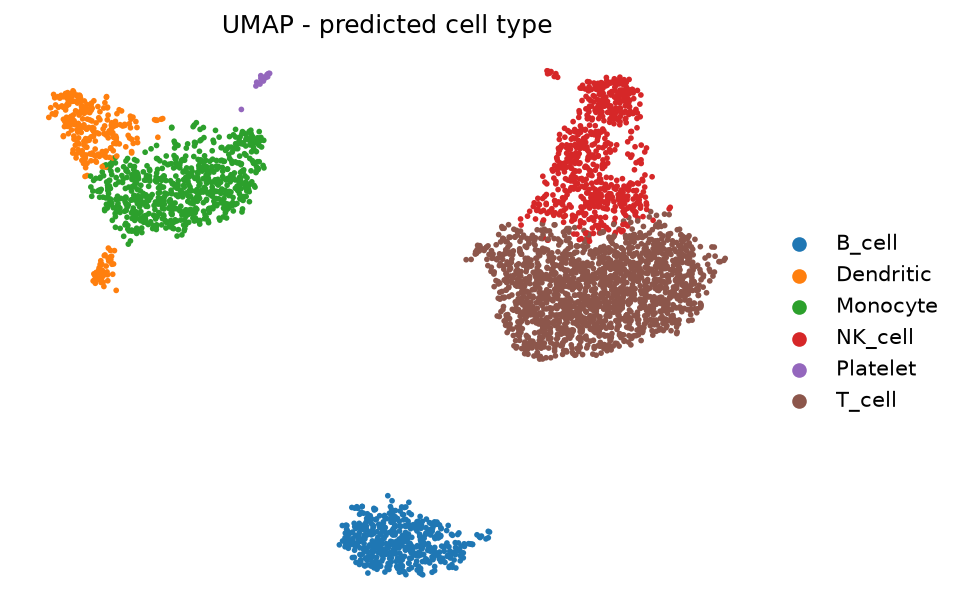

# Single-cell RNA-seq pipeline

A Snakemake pipeline taking droplet-based scRNA-seq from count matrices (or raw FASTQ) to
clustered, annotated cells and a client-ready report. The analysis follows the
[single-cell best-practices book](https://www.sc-best-practices.org/) using Scanpy, and
the FASTQ path uses simpleaf/alevin-fry — the same default as
[nf-core/scrnaseq](https://nf-co.re/scrnaseq).

```
QC -> doublet detection -> normalisation -> HVG -> PCA -> (integration)
   -> Leiden clustering -> UMAP -> marker genes -> annotation -> HTML/PDF report
```

## Two input modes

| | `input_mode: matrix` | `input_mode: fastq` |
|---|---|---|
| Starts from | existing count matrices | raw FASTQ |
| Quantification | – | simpleaf (piscem + alevin-fry) |
| RAM | 8–16 GB for a typical experiment | 16–32 GB to build a human index |
| Intended for | laptops — and most real projects, since cores usually hand you a matrix | cloud VMs, or when you must requantify |
| Config | [`config/config_local.yaml`](config/config_local.yaml) | [`config/config_cloud.yaml`](config/config_cloud.yaml) |

Cell Ranger is deliberately not the default quantifier: it is 10x's proprietary tool under
their EULA, cannot be redistributed via conda, and needs a manual licensed download. Its
output is fully supported as *input* to the matrix mode.

## Quickstart

```bash
mamba env create -f envs/python.yml -n scrnaseq
conda activate scrnaseq

python3 scripts/samplesheet.py my_samples.csv matrix   # validate before running
cp config/config_local.yaml my_config.yaml             # edit paths, QC, resolution
snakemake --configfile my_config.yaml --use-conda --cores 4 -n
snakemake --configfile my_config.yaml --use-conda --cores 4
```

Check the whole thing works first on a small public dataset (~8 MB, 1–2 minutes):

```bash
./test/run_test.sh
```

That runs PBMC 3k and should recover the expected blood cell types (T, B, NK, monocyte,
dendritic, platelet) — a quick end-to-end sanity check that the install is sound.

## Worked example

[`example/`](example/README.md) is that run with its figures committed, so you can see what
the pipeline produces without running it: 4,002 cells, 9 Leiden clusters, Harmony
integration, and annotation recovering all six expected PBMC populations.

[](example/README.md)

## Sample sheets

CSV or TSV. Needs a sample-name column plus either a `matrix` column or `fastq_1`/`fastq_2`.
Common naming conventions are recognised automatically:

| Meaning | Accepted column names |
|---|---|
| Sample name | `sample`, `sample_id`, `name`, `library` |
| Count matrix | `matrix`, `path`, `counts`, `directory`, `h5`, `h5ad` |
| Reads | `fastq_1`/`R1`/`read1`, `fastq_2`/`R2`/`read2` |
| Group | `condition`, `group`, `treatment`, `genotype`, `timepoint` |
| Batch | `batch`, `run`, `donor`, `patient`, `subject` |

The `matrix` column accepts, auto-detected:
- a 10x/Cell Ranger directory containing `matrix.mtx(.gz)` + barcodes + features
  (nested `outs/filtered_feature_bc_matrix` is found automatically)
- a Cell Ranger `.h5`
- an `.h5ad` (AnnData)

Any other columns become cell metadata, usable as `integration.batch_key`.

## Key parameters

| Option | Meaning |
|---|---|
| `qc.min_genes`, `qc.max_pct_mt` | cell filters — inspect `figures/qc_before.png` before trusting the defaults |
| `doublets.enabled` / `.remove` | Scrublet detection; `remove: false` annotates without discarding |
| `cluster.resolution` | Leiden granularity. **This sets how many clusters you get** — it is a dial, not a discovery |
| `integration.method` | `none` or `harmony`; only acts when there is more than one batch |
| `annotation.marker_sets` | gene sets used to give clusters provisional labels |

## Outputs

```
h5ad/        01_qc, 02_doublets, 03_clustered, 04_annotated  (resume from any stage)
figures/     QC violins, UMAPs, dotplot, marker heatmap, composition (PNG)
tables/      markers, cluster sizes/composition, QC summaries, annotation (TSV)
metrics/     one JSON per stage
report/      scrnaseq_report.html / .pdf
logs/        one log per stage
```

Load the final object for your own analysis:

```python
import anndata as ad
adata = ad.read_h5ad("results/h5ad/04_annotated.h5ad")
```

See [docs/usage.md](docs/usage.md) and [docs/outputs.md](docs/outputs.md) for detail, and
[cloud/gcp/](cloud/gcp/README.md) to run the FASTQ path on a VM.

## What this pipeline does *not* do

Being explicit, since these are common expectations:

- **Ambient RNA correction** is not applied. SoupX is R-only and CellBender wants a GPU;
  neither drops cleanly into this Python workflow. If you need it, run it first and feed
  the corrected matrix in as input.
- **Differential abundance between conditions is not tested.** With few biological
  replicates, apparent shifts in cluster proportions are usually noise, and testing them
  properly needs a compositional method (e.g. scCODA, miloR).
- **Cell type labels are provisional**, derived from whichever supplied marker set scores
  highest. They are a hypothesis to check, not an answer.

## References

- [Single-cell best practices](https://www.sc-best-practices.org/) — Heumos et al., *Nat Rev Genet* 2023
- [Scanpy](https://scanpy.readthedocs.io/) — Wolf et al., *Genome Biology* 2018
- [Scrublet](https://github.com/swolock/scrublet) — Wolock et al., *Cell Systems* 2019
- [Harmony](https://github.com/immunogenomics/harmony) — Korsunsky et al., *Nat Methods* 2019
- [alevin-fry](https://github.com/COMBINE-lab/alevin-fry) — He et al., *Nat Methods* 2022
- [nf-core/scrnaseq](https://nf-co.re/scrnaseq) — the reference implementation for the FASTQ path
