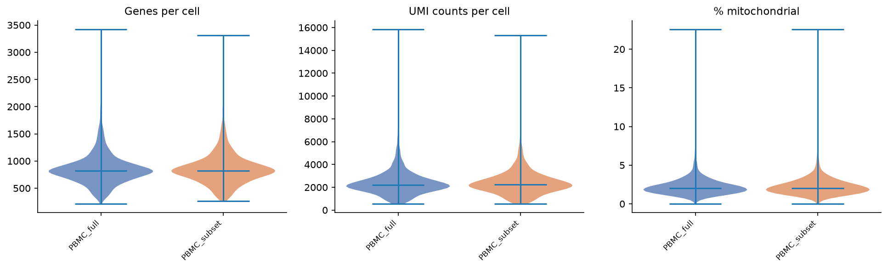
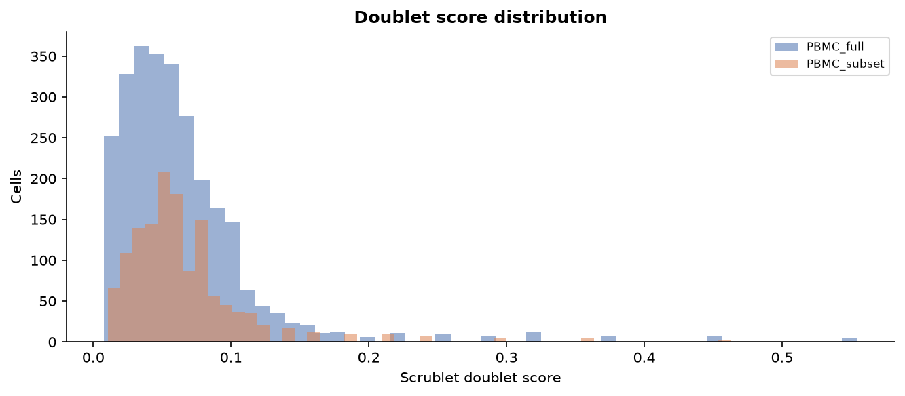
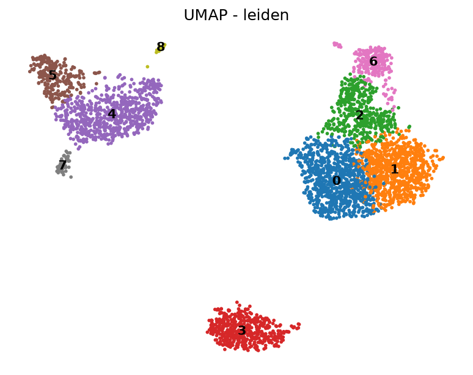
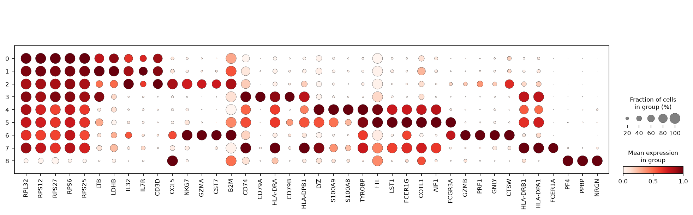
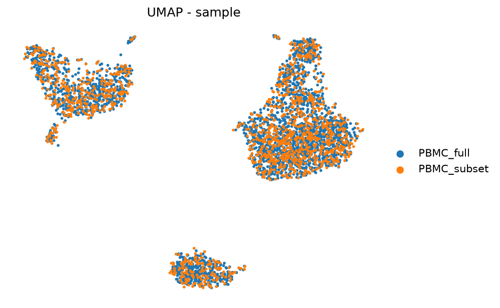
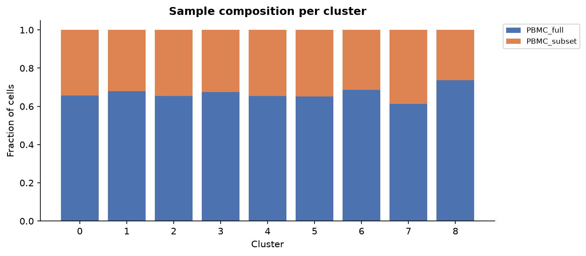

# Worked example: 10x PBMC 3k

A complete run of this pipeline on a real public dataset, start to finish, in under two
minutes on a laptop. The figures below were produced by the pipeline itself and are
committed here, so you can see the output without running anything.

Reproduce it with:

```bash
./test/run_test.sh
```

## The data

[PBMC 3k](https://www.10xgenomics.com/datasets/3-k-pbm-cs-from-a-healthy-donor-1-standard-1-1-0)
from 10x Genomics — 2,700 peripheral blood mononuclear cells from a healthy donor, the
standard reference dataset for single-cell method development.

A second sample is created by subsampling 50% of the cells and writing it as `.h5ad`. It
is **not** a biological replicate; it exists so the run exercises the multi-sample paths —
concatenation, per-sample doublet scoring, cluster composition, Harmony integration — and
both the 10x-directory and `.h5ad` readers, in one go.

## What ran

```
QC → Scrublet doublets → normalisation → HVGs → PCA → Harmony → Leiden → UMAP → markers → annotation
```

| Step | Result |
|---|---|
| Cells loaded | 4,050 |
| Passing QC | 4,048 |
| Doublets removed | 46 |
| **Cells analysed** | **4,002** |
| Genes retained | 14,468 |
| Highly variable genes | 2,000 |
| Batch integration | Harmony, on `sample` |
| Clusters (Leiden, res 1.0) | 9 |
| Significant markers | 3,819 |

## Quality control

Distributions before filtering — genes per cell, UMI counts, and mitochondrial fraction.
Thresholds are explicit in the config rather than hard-coded, and the report states which
were applied.



Doublets are scored per sample, because the doublet rate depends on how heavily each
library was loaded. Scrublet flagged 46 cells (~1.1%).



## Clusters and cell types

Nine Leiden clusters, annotated by scoring each against the PBMC marker sets in the
config.


The structure is what PBMC data should look like: myeloid cells (monocytes, dendritic)
form one territory, T and NK cells sit adjacent to each other in another, and B cells and
platelets separate cleanly. Recovering that from raw counts is the end-to-end sanity check
on the whole pipeline.

| Cluster | Label | | Cluster | Label |
|---|---|---|---|---|
| 0 | T cell | | 5 | Dendritic |
| 1 | T cell | | 6 | NK cell |
| 2 | NK cell | | 7 | Dendritic |
| 3 | B cell | | 8 | Platelet |
| 4 | Monocyte | | | |





## Integration

The two samples overlap cluster-for-cluster after Harmony, which is the expected result
here — the second sample is a subsample of the first, so there is no real batch effect to
remove. It demonstrates that integration runs and does not distort the structure.





## Full output

The run also produces a self-contained HTML report
(`results/report/scrnaseq_report.html`) covering QC, doublets, clustering parameters,
marker genes and annotation, with the interpretation caveats stated inline. Selected
tables are committed here under [`results/`](results/); the annotated `AnnData` object is
written to `results/h5ad/04_annotated.h5ad`.

## Reading these results honestly

The cluster count follows directly from `cluster.resolution` — it is a granularity dial,
not a discovered quantity. Marker gene p-values are computed on the same cells used to
define the clusters, so they are inflated by construction and should be read as a ranking.
The cell type labels are the best-scoring supplied marker set per cluster: a starting
hypothesis to confirm, not an answer. And because the second sample here is a synthetic
subsample, nothing in this example should be read as a comparison between conditions.
